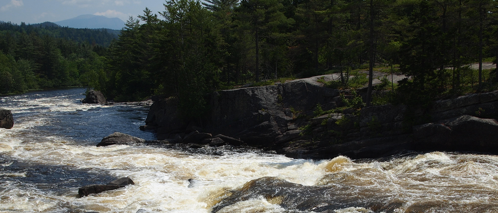

# README
This files contains instructions for how to install the bxslider.
Full instructions and configurations can be found [here](https://github.com/stevenwanderski/bxslider-4)


## Step 1
Copy **both** the /pix/ and /bxslider/ directories into your document root.


## Step 2
Copy the following style sheet link into your head tag.
  <link rel="stylesheet" type="text/css" href="bxslider/bxslider.css" />


## Step 3
Copy the following javascript links into your head tag.

``` css
  <!-- Loads jQuery library via CDN -->
  <script src="https://code.jquery.com/jquery-3.1.0.min.js"></script>
  <!-- Calls bxSlider Javascript file -->
  <script src="bxslider/bxslider.min.js"></script>
  <!-- Calls bxSlider Function -->
  <script src="bxslider/slider.js"></script>
```


## Step 4
Copy the following code into your main style sheet.

``` css
  ul.bxslider {/*-- corrects image position --*/
  	left: -40px;
  	top: -15px;
  }
```


## Step 5
Add the following markup to your HTML.

``` html
  <ul class="bxslider">
    <li></li>
    <li></li>
    <li> </li>
    <li></li>
  </ul>
```


## That's it!
You're done.
